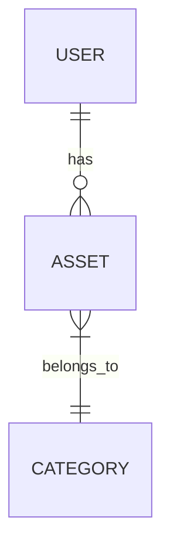

# Data Model for **AssetsBoard**

This document describes the data model for the **AssetsBoard** project. It covers the primary entities, their attributes, and their relationships.

## Main Entities

### User

- **Description**: Represents an investor using the system.
- **Attributes**:
  - **id**: integer - mandatory, unique (primary key, auto-increment)
  - **name**: string - mandatory
  - **email**: string - mandatory, unique
  - **password**: string - mandatory (hashed)
  - **created_at**: datetime - mandatory
  - **updated_at**: datetime - mandatory

### Asset

- **Description**: Represents an investment asset managed by a user.
- **Attributes**:
  - **id**: integer - mandatory, unique (primary key, auto-increment)
  - **category_id**: integer - mandatory (foreign key referencing Category)
  - **value**: decimal - mandatory
  - **quantity**: integer - mandatory
  - **acquisition_date**: date - mandatory
  - **user_id**: integer - mandatory (foreign key referencing User)
  - **created_at**: datetime - mandatory
  - **updated_at**: datetime - mandatory

### Category

- **Description**: Represents a classification for assets based on risk and liquidity.
- **Attributes**:
  - **id**: integer - mandatory, unique (primary key, auto-increment)
  - **name**: string - mandatory, unique
  - **risk**: string - mandatory
  - **liquidity**: string - mandatory
  - **created_at**: datetime - mandatory
  - **updated_at**: datetime - mandatory

## Relationships

- **User** **(one)** ||--o{ **Asset** **(many)**
  - Description: One user (investor) can own many assets.
- **Category** **(one)** ||--o{ **Asset** **(many)**
  - Description: One category can be associated with many assets.

## Mermaid Diagram

_End of Data Model Document for AssetsBoard_
